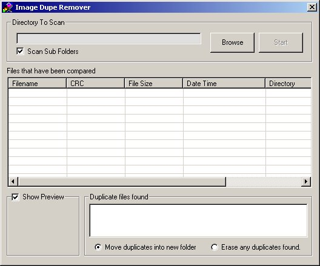

## Image Duplicate Scanner and Remover 1\.4

### Description

This is a easy to use utility to scan your image collection to find the duplicates. This is an ideal tool to use with resource extrators. The utility gives the user the option of moving or deleting any duplicates it finds. Works great for icons.
 
### More Info
 

             |
---                |---
**Submitted On**   |2004-04-27 23:39:12
**By**             |[L\. M\. Trivette ](https://github.com/Planet-Source-Code/PSCIndex/blob/master/ByAuthor/l-m-trivette.md)
**Level**          |Advanced
**User Rating**    |5.0 (15 globes from 3 users)
**Compatibility**  |VB 5\.0, VB 6\.0
**Category**       |[Complete Applications](https://github.com/Planet-Source-Code/PSCIndex/blob/master/ByCategory/complete-applications__1-27.md)
**World**          |[Visual Basic](https://github.com/Planet-Source-Code/PSCIndex/blob/master/ByWorld/visual-basic.md)
**Archive File**   |[Image\_Dupl1738384272004\.zip](https://github.com/Planet-Source-Code/l-m-trivette-image-duplicate-scanner-and-remover-1-4__1-53438/archive/master.zip)

